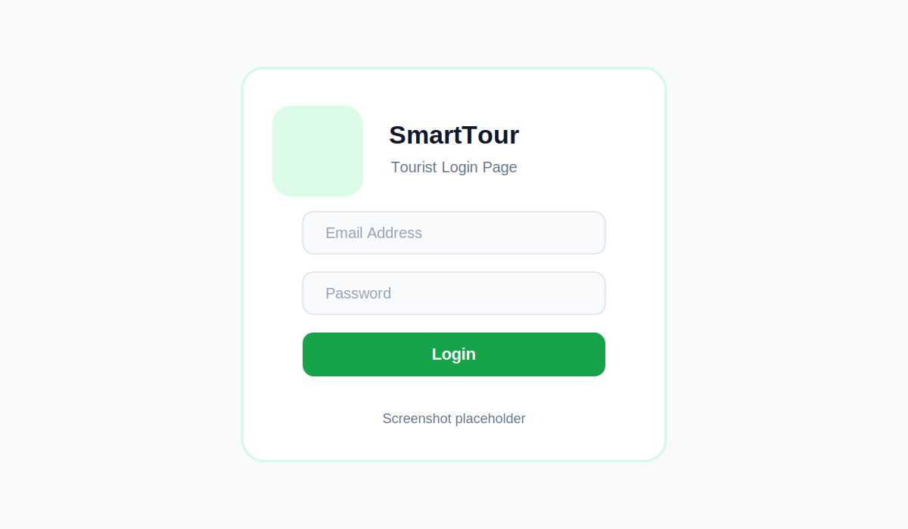
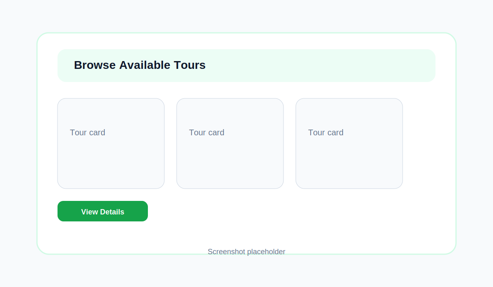
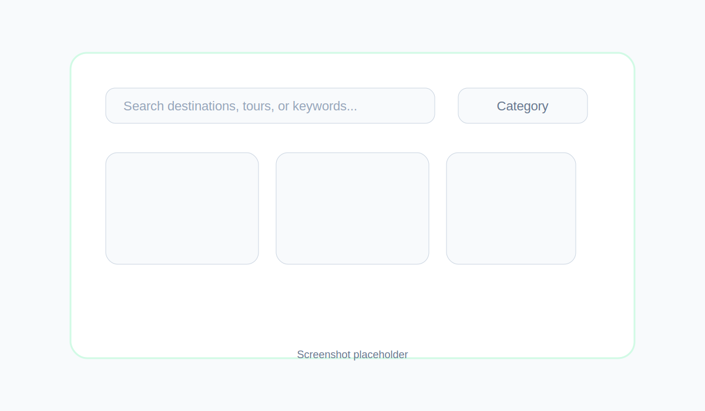
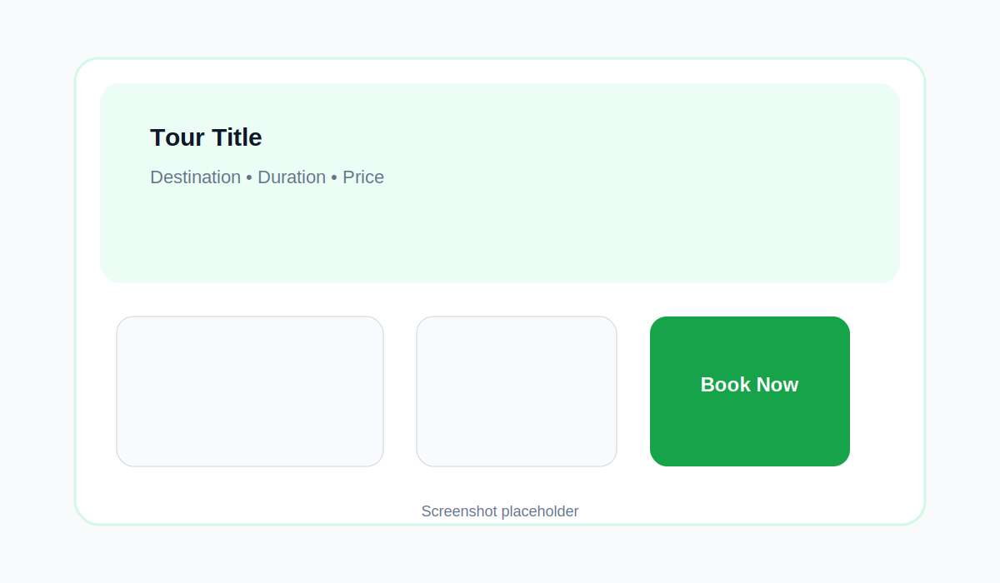
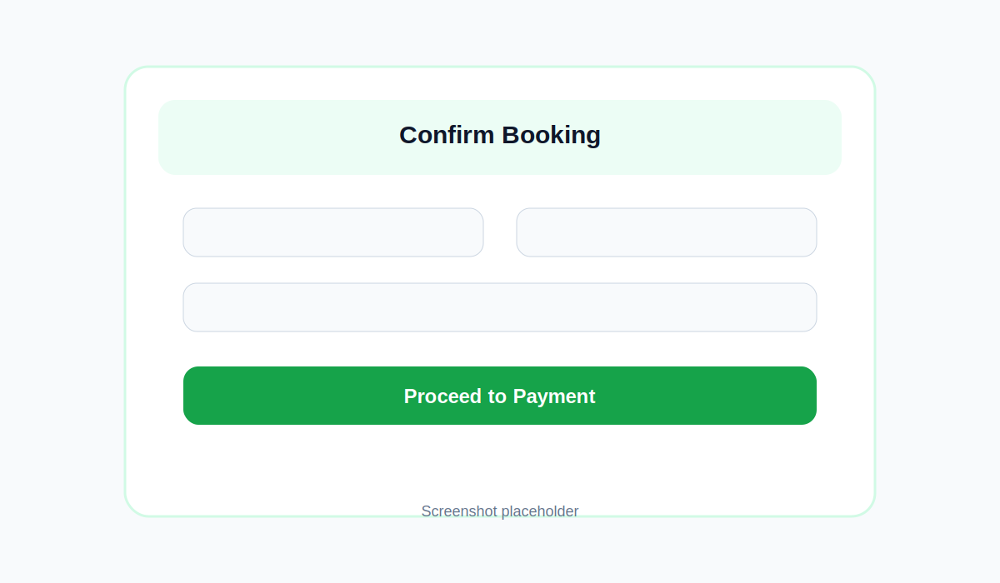

# SmartTour Booking Platform

<div align="center">

A modern, full-featured tour booking platform for exploring Tanzania's natural beauty and cultural heritage. Built with React, Vite, and Tailwind CSS.

[](https://react.dev)
[](https://vitejs.dev)
[](https://tailwindcss.com)
[]()

</div>

## 🎯 Overview

SmartTour Booking is a comprehensive web application that enables tourists to discover and book tours, guides to manage their schedules, operators to create tour offerings, and administrators to oversee the entire platform. The system features role-based authentication, real-time notifications, integrated payment simulation (MPesa), and interactive dashboards tailored to each user type.

---

## ✨ Key Features

### For Tourists
- 🔍 **Tour Discovery**: Browse, filter, and search tours by destination and category
- 🛒 **Booking Management**: Reserve tours with detailed booking confirmation
- 💳 **Payment Integration**: Simulate MPesa payment processing
- 📅 **My Bookings**: View, track, and manage current and past bookings
- ⭐ **Reviews & Ratings**: Read and leave reviews for completed tours
- 👤 **User Profile**: Manage personal information and preferences
- 🎯 **Tour Planning**: Access travel tips and destination information

### For Tour Guides
- 📊 **Guide Dashboard**: View assigned tours and upcoming schedules
- 📋 **Tour Management**: Manage assigned tour details and timings
- 📞 **Guest Interaction**: Access guest lists and contact information

### For Tour Operators
- 🏢 **Operator Dashboard**: Create and manage tour offerings
- 📈 **Tour Analytics**: Track bookings and revenue
- 🛠️ **Tour Operations**: Edit, update, and manage active tours
- 📊 **Performance Metrics**: Monitor booking trends

### For Administrators
- 👥 **User Management**: Manage all platform users and roles
- 🏪 **Operator Management**: Oversee tour operators
- 🎫 **Tour Management**: Manage all tours on the platform
- 📋 **Booking Management**: Monitor and manage all bookings
- 📊 **Reports & Analytics**: Generate system-wide reports
- 🔐 **Access Control**: Manage permissions and roles
- 📝 **System Logs**: Track platform activities

### General Features
- 🔐 **Multi-Role Authentication**: Secure login for different user types
- 🌙 **Dark/Light Theme**: Toggle between themes
- 🔔 **Toast Notifications**: Real-time user feedback
- 📱 **Responsive Design**: Mobile-friendly interface
- ⚡ **Performance Optimized**: Built with Vite for fast development
- 🧪 **Comprehensive Testing**: Unit and integration tests

---

## 🛠️ Tech Stack

| Technology | Purpose |
|-----------|---------|
| **React 19** | UI library and component framework |
| **Vite 5** | Fast build tool and dev server |
| **React Router v6** | Client-side routing |
| **Tailwind CSS** | Utility-first CSS styling |
| **Framer Motion** | Smooth animations and transitions |
| **React Context API** | State management |
| **Vitest** | Unit testing framework |
| **ESLint** | Code quality and linting |

---

## 📋 Prerequisites

Before you begin, ensure you have installed:
- **Node.js** (v16.0.0 or higher)
- **npm** (v8.0.0 or higher) or **yarn**
- **Git**

Verify installation:
```bash
node --version
npm --version
```

---

## 🚀 Getting Started

### 1. Clone the Repository
```bash
git clone https://github.com/yourusername/smart-tour-booking.git
cd smart-tour-booking
```

### 2. Install Dependencies
```bash
npm install
```

### 3. Start Development Server
```bash
npm run dev
```

The application will be available at **http://localhost:5173**

---

## 📦 Available Scripts

| Command | Description |
|---------|-------------|
| `npm run dev` | Start development server with hot reload |
| `npm run build` | Build optimized production bundle |
| `npm run preview` | Preview production build locally |
| `npm run lint` | Run ESLint to check code quality |
| `npm test` | Run unit and integration tests |

---

## 📁 Project Structure

```
smart-tour-booking/
├── src/
│   ├── pages/                      # Page components (routes)
│   │   ├── Home.jsx               # Landing page
│   │   ├── Tours.jsx              # Tours listing page
│   │   ├── Booking.jsx            # Booking confirmation page
│   │   ├── MyBookings.jsx         # User bookings page
│   │   ├── Profile.jsx            # User profile management
│   │   ├── Destinations.jsx       # Tour destinations
│   │   ├── About.jsx              # About page
│   │   ├── Privacy.jsx            # Privacy policy
│   │   ├── Terms.jsx              # Terms of service
│   │   ├── Login.jsx              # Authentication page
│   │   ├── Register.jsx           # User registration
│   │   ├── TravelTips.jsx         # Travel tips and guides
│   │   ├── TourDetails.jsx        # Individual tour details
│   │   ├── Planner.jsx            # Tour planning tool
│   │   ├── admin/                 # Admin pages
│   │   │   ├── Dashboard.jsx      # Admin dashboard
│   │   │   ├── Users.jsx          # User management
│   │   │   ├── Operators.jsx      # Operator management
│   │   │   ├── ToursAdmin.jsx     # Tour management
│   │   │   ├── AdminBookings.jsx  # Booking management
│   │   │   ├── Reports.jsx        # Analytics & reports
│   │   │   └── Logs.jsx           # System activity logs
│   │   ├── guide/                 # Guide pages
│   │   │   └── GuideDashboard.jsx # Guide dashboard
│   │   ├── operator/              # Operator pages
│   │   │   └── OperatorDashboard.jsx
│   │   └── tourist/               # Tourist pages
│   │       └── Tours.jsx
│   │
│   ├── components/                # Reusable components
│   │   ├── Navbar.jsx             # Navigation bar
│   │   ├── Footer.jsx             # Footer component
│   │   ├── Tourcard.jsx           # Tour card display
│   │   ├── ToastProvider.jsx      # Toast notification provider
│   │   ├── ToastItem.jsx          # Individual toast item
│   │   ├── MpesaSimulator.jsx     # MPesa payment simulator
│   │   ├── admin/                 # Admin components
│   │   │   ├── AdminSidebar.jsx   # Admin navigation
│   │   │   ├── DashboardLayout.jsx
│   │   │   ├── PageHeader.jsx
│   │   │   ├── SearchBar.jsx
│   │   │   ├── StatCard.jsx
│   │   │   └── StatusBadge.jsx
│   │   └── tourist/               # Tourist components
│   │       ├── TourCard.jsx
│   │       └── TourFilters.jsx
│   │
│   ├── context/                   # React Context providers
│   │   ├── AuthContext.jsx        # Authentication state
│   │   ├── DataContext.jsx        # Application data state
│   │   ├── ThemeContext.jsx       # Theme (dark/light) state
│   │   └── ToastContext.jsx       # Toast notifications state
│   │
│   ├── hooks/                     # Custom React hooks
│   │   └── useToast.js            # Toast notification hook
│   │
│   ├── services/                  # Business logic services
│   │   ├── paymentService.js      # Multi-method payment processing (M-Pesa, Airtel, Card, Bank)
│   │   └── notificationService.js # Notification handling
│   │
│   ├── data/                      # Mock/static data
│   │   ├── tours.js               # Tour data
│   │   ├── users.js               # User data
│   │   ├── bookings.js            # Booking data
│   │   └── reviews.js             # Review data
│   │
│   ├── App.jsx                    # Main app component
│   ├── App.css                    # App styling
│   ├── main.jsx                   # Entry point
│   └── index.css                  # Global styles
│
├── public/                        # Static assets
├── test/                          # Test files
│   ├── app-routes.test.jsx        # Route testing
│   ├── context.test.jsx           # Context testing
│   ├── services.test.jsx          # Service testing
│   └── setup.js                   # Test setup
│
├── package.json                   # Dependencies and scripts
├── vite.config.js                 # Vite configuration
├── eslint.config.js               # ESLint configuration
└── README.md                      # This file
```

---

## � Tourist Interface Documentation

### 4.3.3 Tourist Login Page



#### Purpose
Allows registered tourists to authenticate before accessing protected system features such as booking, profile management, and personal bookings.

#### Functionalities
- Email field
- Password field
- Login button
- Password masking
- Authentication through the auth context
- Error handling with inline messages and toast notifications

#### Implementation
The login experience is implemented on the Login page and is routed through the `/login` path. The form validates that both the email address and password are supplied before submission. On successful authentication, the application calls the login service, displays a success toast, and redirects the user to the most appropriate destination, such as the tours page, the previous protected page, or the bookings page when prior reservations exist.

#### Requirement Addressed
> The system must allow tourists to log into the system.

### 4.3.4 Browse Available Tours



#### Purpose
Displays all available tour packages so tourists can review and select a suitable experience.

#### Functionalities
- Tour cards
- Tour images
- Price information
- Duration information
- Destination information
- View Details button for each tour

#### Implementation
The tours listing is displayed on the Tours page and is routed through `/tours`. Each card presents core tour details and includes a navigation link that opens the relevant Tour Details page for deeper information.

#### Requirement Addressed
> The system must allow tourists to browse available tours.

### 4.3.5 Search Tours



#### Purpose
Enables tourists to quickly find tours based on destination, keywords, or category.

#### Functionalities
- Search box
- Filtering by destination and category
- Dynamic search results that update as the user types

#### Implementation
The search experience is implemented on the Tours page using an interactive search field and category dropdown. The results are filtered dynamically from the available tour list based on the user’s query and selected category, providing immediate feedback as the search criteria change.

#### Requirement Addressed
> The system must allow tourists to search tours by destination.

### 4.3.6 Tour Details



#### Purpose
Provides detailed information about a selected tour so tourists can evaluate the experience before booking.

#### Functionalities
- Tour description
- Price information
- Duration information
- Destination information
- Booking button

#### Implementation
The detailed tour view is implemented on the Tour Details page and is routed through `/tour/:id`. It displays the tour description, visual gallery, included features, and a booking call-to-action. If the tourist is not authenticated, the button directs them to the login page and preserves the intended booking destination.

#### Requirement Addressed
> The system must allow tourists to view detailed information about a selected tour.

### 4.3.7 Tour Booking



#### Purpose
Allows tourists to reserve a selected tour package by submitting booking details and completing a payment step.

#### Functionalities
- Booking form
- Personal information fields
- Number of travellers input
- Special requests input
- Booking confirmation and payment simulation

#### Implementation
The booking flow is handled on the Booking page and is routed through `/booking/:id`. Authenticated tourists can review the selected tour, enter traveler details, add special requests, and complete a simulated M-Pesa payment. After success, the booking is saved and the user is redirected to their bookings page for confirmation.

#### Requirement Addressed
> The system must allow tourists to book a tour package.

---

## �👥 User Roles & Capabilities

### 1. **Tourist** 🎒
- Browse and search available tours
- View detailed tour information
- Make tour bookings with MPesa payment
- View booking history and status
- Leave reviews and ratings
- Manage personal profile
- Access travel tips and destination guides

### 2. **Tour Guide** 👨‍🏫
- View assigned tours
- Check upcoming schedules
- Access guest lists for tours
- Manage tour details (subject to operator approval)
- Track tour completion status

### 3. **Tour Operator** 🏢
- Create and manage tour offerings
- Update tour details and pricing
- Monitor booking requests
- View revenue and analytics
- Manage guide assignments
- Track tour operations

### 4. **Administrator** 🔑
- Full platform access
- Manage all user accounts
- Oversee tour operators
- Monitor all tours and bookings
- Generate reports and analytics
- View system logs and activities
- Set platform policies

---

## 🔐 State Management

The application uses **React Context API** for global state management:

### Available Contexts

#### **AuthContext**
Manages user authentication and authorization
```javascript
{
  user: { id, name, email, role },
  isAuthenticated: boolean,
  login: function,
  logout: function,
  register: function
}
```

#### **DataContext**
Manages application data (tours, bookings, users)
```javascript
{
  tours: [],
  bookings: [],
  users: [],
  addTour: function,
  updateBooking: function
}
```

#### **ThemeContext**
Manages light/dark theme preference
```javascript
{
  isDark: boolean,
  toggleTheme: function
}
```

#### **ToastContext**
Manages toast notifications
```javascript
{
  toasts: [],
  addToast: function,
  removeToast: function
}
```

---

## 💳 Payment Simulation (MPesa)

The application includes a **MPesa Payment Simulator** component for testing payment flows:

- **Component**: `MpesaSimulator.jsx`
- **Service**: `paymentService.js`
- **Features**:
  - Phone number validation
  - Amount verification
  - Transaction simulation
  - Success/failure scenarios
  - Transaction history

### Testing Payment Flow
1. Navigate to booking confirmation page
2. Click "Complete Payment with MPesa"
3. Enter test phone number (07xxxxxxxx)
4. Enter amount
5. Confirm transaction

---

## 🧪 Testing

### Running Tests
```bash
npm test
```

### Test Files
- **app-routes.test.jsx**: Tests for routing logic
- **context.test.jsx**: Tests for context providers
- **services.test.jsx**: Tests for service functions
- **setup.js**: Test environment setup

### Testing Approach
- Unit tests for services and utilities
- Integration tests for context and routing
- Component rendering tests
- User interaction simulations

---

## 🎨 Styling

The project uses **Tailwind CSS** for styling with a consistent design system:

### Color Palette
- **Primary**: Blue (#3B82F6)
- **Secondary**: Indigo (#6366F1)
- **Success**: Green (#10B981)
- **Warning**: Amber (#F59E0B)
- **Danger**: Red (#EF4444)

### Responsive Breakpoints
- Mobile: < 640px
- Tablet: 640px - 1024px
- Desktop: > 1024px

---

## 🔧 Development Guidelines

### Code Standards
- Follow ESLint rules: `npm run lint`
- Use functional components with hooks
- Organize components by feature
- Keep components small and focused
- Use meaningful variable and function names

### Component Structure
```jsx
import { useContext } from 'react';

export default function ComponentName() {
  // 1. Hooks
  // 2. State
  // 3. Effects
  // 4. Handlers
  // 5. Render
  
  return (
    <div>
      {/* JSX */}
    </div>
  );
}
```

### Naming Conventions
- Components: PascalCase (e.g., `TourCard.jsx`)
- Files: PascalCase for components, camelCase for utilities
- Functions: camelCase
- Constants: UPPER_SNAKE_CASE

---

## 📱 Browser Support

- Chrome (latest)
- Firefox (latest)
- Safari (latest)
- Edge (latest)

---

## 🚀 Deployment

### Build for Production
```bash
npm run build
```

### Preview Production Build
```bash
npm run preview
```

### Deployment Platforms
- **Vercel**: Optimized for Vite projects
- **Netlify**: Simple deployment from git
- **GitHub Pages**: Static hosting
- **AWS S3 + CloudFront**: Scalable CDN

---

## 📊 Features Roadmap

- [ ] Email notification system
- [ ] Advanced filtering and search
- [ ] Booking cancellation and refunds
- [ ] Guide verification system
- [ ] Real payment gateway integration
- [ ] Multi-language support
- [ ] Accessibility improvements (WCAG 2.1)
- [ ] Progressive Web App (PWA)
- [ ] Real-time notifications with WebSockets
- [ ] Advanced analytics dashboard

---

## 🤝 Contributing

Contributions are welcome! Please follow these steps:

1. Fork the repository
2. Create a feature branch (`git checkout -b feature/amazing-feature`)
3. Commit your changes (`git commit -m 'Add amazing feature'`)
4. Push to the branch (`git push origin feature/amazing-feature`)
5. Open a Pull Request

### Pull Request Guidelines
- Describe the changes clearly
- Include tests for new features
- Update documentation as needed
- Follow code style guidelines
- Ensure all tests pass

---

## 📝 License

This project is licensed under the MIT License - see the [LICENSE](LICENSE) file for details.

---

## 📞 Support & Contact

For questions, issues, or suggestions:
- **Email**: support@smarttour.tz
- **Issues**: [GitHub Issues](https://github.com/yourusername/smart-tour-booking/issues)
- **Discussions**: [GitHub Discussions](https://github.com/yourusername/smart-tour-booking/discussions)

---

## 🙏 Acknowledgments

- Tanzania Tourism Board for inspiration
- React community for excellent documentation
- Tailwind CSS for beautiful styling system
- All contributors who have helped with this project

---

<div align="center">

**Made with ❤️ for Tanzania tourism lovers**

[⬆ back to top](#smarttour-booking-platform)

</div>